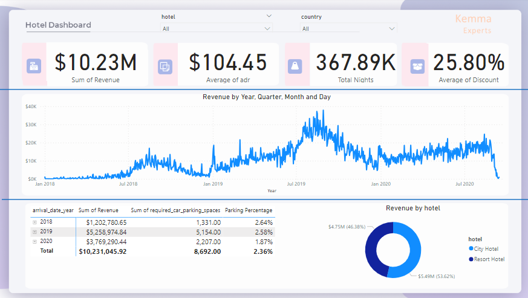

# Hotel-Dashboard-With-SQL-and-Power-BI
## INTRODUCTION
In this project, I built a Database, developed, an SQL query, connected Power BI to the Database,
visualized the data suitable for management decisions, summarized the findings

## PROBLEM STATEMENT
To build a visual data story or dashboard using Power BI to present to stakeholders
We sort to answer the following questions

-- Is our hotel revenue growing by year?

-- Should we increase our packing lot size?

-- What trend can we see in the data?

## TOOLS
* SQL Server | Data Analysis

  
* Power Query | Data Manipulation and Cleaning

  
* Power BI | Reports and Visualization

  
## SKILLS DEMONSTRATED
- SQL | SSMS, SQL 

- Power Query

## DATA SOURCING
The primary data source used for this analysis is the sales data containing detailed data about each sale by the company
## DATA TRANSFORMATION
In the initial data preparation stage I performed the following task:
- Data loading and Inspection
- Handling missing values
- Data cleaning and transformation

## ANALYSIS AND VISUALIZATION
## CONCLUSION AND RECOMMENDATION

